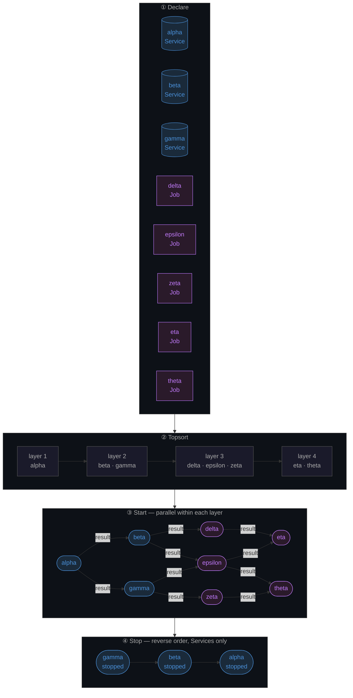

# Saola

Saola is a Clojure library for lifecycle and dependency management. It starts and stops your components in the correct order, runs independent components in parallel, and threads results between them.

## Installation

```clojure
[org.clojars.jj/saola "1.0.1"]
```

## How It Works

Saola takes your components, builds a dependency graph, and topologically sorts it into layers. Components in the same layer have no dependency on each other and start in parallel. Each component receives the results of its dependencies injected into its config map.



## Core Concepts

Saola has two types of components:

- **Service** — a long-lived process (database pool, HTTP server, cache). Has `start` and `stop`. The value returned by `start` is passed to `stop` on shutdown.
- **Job** — a short-lived process (ETL step, migration, report). Has only `start-job`. The return value is made available to downstream dependents.

## Usage

### Define your components

```clojure
(require '[jj.saola.protocols :refer [Job Service start start-job stop]])

(defrecord DatabaseService [id]
  Service
  (start [this config]
    {:connection (connect! (:db-url config))})
  (stop [this result]
    (disconnect! (:connection result))))

(defrecord ExtractJob [id dependencies]
  Job
  (start-job [this config]
    ;; :database key is injected automatically from DatabaseService's start result
    (extract-rows (:database config))))

(defrecord TransformJob [id dependencies]
  Job
  (start-job [this config]
    (transform-rows (:extract config))))
```

### Start the system

Pass a sequence of components to `start-system` along with a base config map. Dependencies are declared inline — no separate registry step needed.

```clojure
(require '[jj.saola :as saola])

(def system
  (saola/start-system
    [(->DatabaseService :database)
     (->ExtractJob      :extract   [:database])
     (->TransformJob    :transform [:extract :database])]
    {:db-url "jdbc:postgresql://localhost:5432/mydb"}))
```

Each component receives the merged base config plus the start/job results of its declared dependencies, keyed by their id:

```clojure
;; TransformJob receives:
{:db-url    "jdbc:postgresql://localhost:5432/mydb"
 :database  {:connection ...}   ; from DatabaseService/start
 :extract   [,,,]}              ; from ExtractJob/start-job
```

`start-system` returns a system map:

```clojure
{:all-results     {,,,}   ; every component's result, keyed by id
 :services        {,,,}   ; service results only
 :job-results     {,,,}}  ; job results only
```

### Stop the system

```clojure
(saola/stop-system system)
```

Services are stopped in reverse dependency order. Jobs are not stopped (they are already done). The value returned by `start` is passed back into `stop`, so no external state is needed.

## License

Copyright © 2025 [ruroru](https://github.com/ruroru)

This program and the accompanying materials are made available under the
terms of the Eclipse Public License 2.0 which is available at
http://www.eclipse.org/legal/epl-2.0.

This Source Code may also be made available under the following Secondary
Licenses when the conditions for such availability set forth in the Eclipse
Public License, v. 2.0 are satisfied: GNU General Public License as published by
the Free Software Foundation, either version 2 of the License, or (at your
option) any later version, with the GNU Classpath Exception which is available
at https://www.gnu.org/software/classpath/license.html.